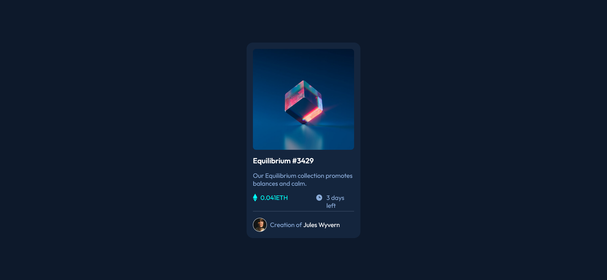

# Frontend Mentor - NFT preview card component solution

This is a solution to the [NFT preview card component challenge on Frontend Mentor](https://www.frontendmentor.io/challenges/nft-preview-card-component-SbdUL_w0U). Frontend Mentor challenges help you improve your coding skills by building realistic projects. 

### The challenge

Users should be able to:

- View the optimal layout depending on their device's screen size
- See hover states for interactive elements

### Screenshots

#### Desktop Layout
;

#### Mobile Layout
;

### Links 

- Solution URL: [github - yorchAdalbert ](https://github.com/yorchAdalbert/ntf-component)
- Live Site URL: [NFT card component ](https://yorchadalbert.github.io/ntf-component/src/)

### Built with

- HTML5
- SASS
- Flexbox
- Responsive

### What I learned

With this project I learned to implement the SASS methodology. I created a SASS file structure ready to grow.

## Author

- Website - [Jorge Rodriguez](http://www.yorchadalbert.com)
- Frontend Mentor - [@yorchAdalbert](https://www.frontendmentor.io/profile/yorchAdalbert)